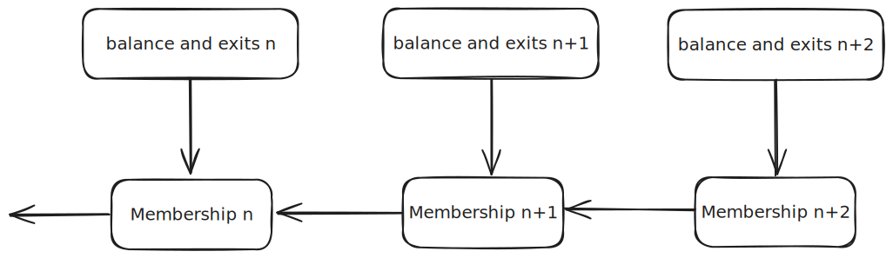

# RISC Lido Accounting Oracle

Implements a second-opinion accounting oracle for Lido compatible with [LIP-23](https://github.com/lidofinance/lido-improvement-proposals/blob/develop/LIPS/lip-23.md) using RISC Zero

This oracle performs provable computation over historical beacon state to determine at a given slot:

- *clBalanceGwei* - The total balance held by Lido validators
- *totalDepositedValidators* - The number of Lido validators ever to deposit
- *totalExitedValidators* - The number of Lido validators that have exited
- *withdrawalVaultBalance* - The balance of the WithdrawalVault contract on the execution layer

## Design

The oracle uses a proof composition approach to cache prior computation where possible and minimize the amount of beacon state data needed as input. It also allows the oracle to be stateless minimizing on-chain costs and allowing it to be reused anywhere a trusted beacon block root is available. This is done using two proofs - the `membership` proof which is updatable, and the `balance_and_exists` proof which consumes a membership proof and proves the values used by the oracle.

The proof composition can be viewed as follows where an arrow indicates that a proof depends on the validity of its child



### Membership Proof

The membership proof takes advantage of the fact that a Lido validator can be identified by its `withdrawal_credential` field in the beacon state, and that this value is immutable once set to an [Eth1 address withdrawal prefix](https://eth2book.info/capella/part3/config/constants/#eth1_address_withdrawal_prefix). This means once a validator has been scanned and its membership stored this does not need to be checked again (unless a future fork allows this value to be changed).

> [!NOTE]
> Although non-Lido validators may have the same withdrawal credential this is acceptable for the oracle as discussed in [LIP-23](https://github.com/lidofinance/lido-improvement-proposals/blob/develop/LIPS/lip-23.md#matching). 

The membership proof asserts the following:

```
GIVEN:
    - prior membership set (or null)
    - prior state root (or null)
    - prior max validator index (or null)
    - new membership set
    - new state root
    - new max validator index
    - validator withdrawal credentials for validators [..]
    - SSZ merkle proofs for all data rooted in the beacon state

ASSERTS:
    - prior state root is a parent state of the current state root
    - The prior membership set is valid at the prior state root (by verifying the previous proof)
    - Appending to the prior membership by processing validators [..] results in the new membership set
    - All beacon data is contained in the beacon state with the given state root
```

This results in an updatable proof of the set of beacon validators that have the Lido validator withdrawal credentials up to some max validator index.

Following beacon chain conventions the membership set is stored as a bitmask where a 1 indicates a Lido validator and a 0 otherwise. This is more efficient provided the number of Lido validators is greater than 1/64th of the Validator set (currently >30%).

### Balance and Exits Proof

Unfortunately the balance and exit status of validators changes per epoch and so the $clBalance$ and $totalExitedValidators$ computations cannot be cached. The upside is that given a membership set, the data for non-Lido validators can be omitted reducing the size of the input by 2/3.  

The balance and exits proof proves computation of the aggregation of the total balance of non-exited Lido validators as well as the total count of validators (exited or not) and the total count of exited Lido validators.

```
GIVEN:
    - membership set and proof
    - block root
    - SSZ merkle proof for the state root within the block
    - SSZ merkle proof for all required state values
        - balance and exit epoch for all membership validators
    - the asserted clBalance, totalDepositedValidators and totalExitedValidators values
    - A RISC Zero Steel proof of the withdrawal vault balance

ASSERTS:
    - The membership proof is valid
    - The Steel proof is valid
    - The number of validators in the membership set is equal to the total number of validators
    - The given state root is contained within the block header with the given block root
    - The aggregates clBalance, totalDepositedValidators, totalExitedValidators can be calculated by processing the data for all Lido validators indicated by the membership set
    - All beacon data is contained in the beacon state with the given state root
```

This proof can then be submitted on-chain where it can be checked against a trusted beacon block root obtained through [EIP-4788](https://eips.ethereum.org/EIPS/eip-4788). 

## Development

### Prerequisites

First, [install Rust][install-rust] and [Foundry][install-foundry], and then restart your terminal.

```sh
# Install Rust
curl https://sh.rustup.rs -sSf | sh
# Install Foundry
curl -L https://foundry.paradigm.xyz | bash
```

Next, you will use `rzup` to install `cargo-risczero`.

To install `rzup`, run the following command and follow the instructions:

```sh
curl -L https://risczero.com/install | bash
```

Next we can install the RISC Zero toolchain by running `rzup`:

```sh
rzup install
```

You can verify the installation was successful by running:

```sh
cargo risczero --version
```

This repo uses [just](https://github.com/casey/just) as a command runner. Installation instructions [here](https://github.com/casey/just?tab=readme-ov-file#installation)

## Running tests

Use

```shell
just test
```

Attempting to run tests with `cargo test` will fail unless you can generate proofs locally, and even then it will take a long time.

## Usage

### Configuration

Building proofs requires access to a beacon chain RPC (that supports the `debug_` methods), an execution layer RPC, and a proving service (e.g. Bonsai or Boundless). 

> [!IMPORTANT]
> Many beacon chain RPC provides do not support the required debug methods for retrieving beacon state to build a proof. Quiknode is known to provide this but there may also be others.

These are configured via environment variables. Copy the [.env.example] to a .env file in the repo root and configure for your remote services.

### Contract Deployment

Simple deployment with

```shell
just deploy
```

This will read the .env file for RPC and other params.

See the [deployment guide](./docs/deployment-guide.md) for instructions on deploying to different chains

### Simple Usage via CLI

Using the justfile scripts provides a simple way to get started and examples of using the CLI. These will write intermediate proof files into the current directory.
These are mostly included for example usage of the CLI. For a production deployment use the CLI directly as required.

#### Initial membership proof

To create a proof run

```shell
just prove_membership_init <slot>
```

> [!NOTE]
> This will take a long time for the first run but only needs to be done once. Subsequent runs can recursively update this proof which will be much faster.

#### Updating a membership proof

Update an existing membership proof to a newer beacon chain slot you will need to build the inputs and then build a proof. Run

```shell
just prove_membership_continuation <slot> <new_slot>
```

This will write a new proof that composes the old one and proves the membership of all validators up to slot `new_slot`. There is no need to update membership proofs but it is a good way to save proving cycles.

#### Building an aggregate oracle proof

To build a proof at a slot ready to submit on-chain run:

```shell
just prove_aggregate <slot>
```

This requires that a membership proof (either initial or continuation) for `slot` has already been created. It will write to file a proof and report ready to submit on-chain


Submit on-chain with:

```shell
just submit <slot>
```

#### More advanced usage

Using the CLI directly provides more flexibility. See the help and subcommands help

```
> cargo run -- --help
CLI for generating and submitting Lido oracle proofs

Usage: cli [OPTIONS] --slot <SLOT> <COMMAND>

Commands:
  prove   Generate a proof from a given input
  submit  Submit an aggregation proof to the oracle contract
  help    Print this message or the help of the given subcommand(s)

Options:
      --slot <SLOT>
          slot at which to base the proofs
      --max-validator-index <MAX_VALIDATOR_INDEX>
          The top validator index proofs  will be extended to. If not included it will proceed up to the total number of validators in the beacon state at the given slot. This does nothing for aggregation proofs which must be run for all validators
  -h, --help
          Print help
  -V, --version
          Print version
```


## Security Disclaimer

Code is unaudited and not yet ready for production use
